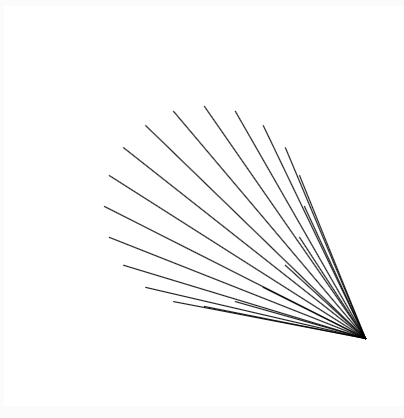

## Homework 4 (due Thursday night, October 4, 2018)

You will be submitting each homework assignment into a new GitHub repository each week. [Here are instructions on how to do so.](https://github.com/zamfi/github-guide/blob/master/README.md) Please [email me](mailto:zamfi@cca.edu) if you have any questions!

### Classwork wrap-up

**Assignment**: In class, you created animations inspired by four example sketches. Post two of your favorites to your homework repository.

If you worked with a partner, you can both submit the same work -- but be sure to note at the top (in a comment, i.e., a line that starts with `//`) who your collaborators were.

### Practice with Loops

In class and in last week's homework, we talked about how loops work. Here's a brief refresher on `for` loops in particular:

```javascript
for (var i = 0; i < 10; i = i + 1) {
  print(i);
}
```

- `var i = 0;` -- **initializer**, runs before the loop starts.
- `i < 10` -- **condition**, runs each time through the loop to check if loop should run again.
- `i = i + 1` -- **increment**, runs after the loop body to change the loop variable.
- `print(i)` -- **body**, the actual code in the loop that is run repeatedly.

If you want more resources on these loops, also consider the [Khan academy tutorial about loops](https://www.khanacademy.org/computing/computer-programming/programming/looping/pt/intro-to-while-loops).

Now, consider the following sketch:

```javacsript
function setup() {
  createCanvas(400, 400);
}

function draw() {
  background(255);

  for (var x = 10; x < width-10; x = x + 10) {
    line(x, height/2, mouseX, mouseY);
  }
}
```

Answer the following questions in your homework repository's README.md file:

1. How many lines are drawn each frame? In other words, how often does the `for` loop run?
2. What do the first, second, and third appearances of the number `10` do in the code?

Next, make the following changes:

1.  **Assignment**: Increase the left and right margins on the sketch by changing the **initializer** and **condition** of the `for` loop above. Save in your repo as `bigger-margins.js`.
2.  **Assignment**: Spread the lines further apart by changing the **increment** of the `for` loop above. Save in your repo as `spaced-lines.js`.
3.  **Assignment**: Modify the code above to draw each line in a different color. Consider using `HSB` color mode and re-using the `x` variable as the hue. Save in your repo as `colored-lines.js`.
4.  **Optional challenge**: Make the lines originate from a circle, not a line, like so:
    
    
    
    ...you may find trigonometry useful (in particular, the `sin` and `cos` functions that convert an angle into `x` and `y` coordinates, respectively.) Save in your repo as `circle-lines.js`.


Starting with this set of incomplete code:

```javascript
function setup() {
  createCanvas(400, 400);
  colorMode(HSB);
}

function draw() {
  background(255);

  for (var x = ???; x < ???; x = x + ???) {
    line(x, height/2, x+100, height/2-75);
  }
}
```

1.  **Assignment**: Replace each `???` in the code above with an expression (that is, a number or mathematical expression that produces a number, like `width + 20`) to create a sketch that looks something like this:
    
    
    
    Save in your repo as `angle-lines.js`.

2.  **Optional Challenge**: Animate this sketch by having the anled lines march forward or backwards. Save in your repo as `lines-on-the-move.js`

### Practice with Arrays

In class and in last week's homework, we talked about how arrays work. Here's a brief refresher:

- `var listName = [];` -- create a new array
- `listName[3]` -- access item at index 3 (the *fourth* item) in the array
- `listName[3] = 7` -- set the item at index 3 to the number 7.
- `listName.push(12)` -- add the number 12 to the end of the array
- `listName.length` -- get the number of elements in the array

If you want more resources on arrays, also consider the [Khan academy tutorial on arrays](https://www.khanacademy.org/computing/computer-programming/programming/arrays/pt/intro-to-arrays).

Now, here's a sketch that relies on arrays and a loop:

```javascript
function setup() {
  createCanvas(400, 400);
}

var x = []; // new empty array
var y = []; // new empty array

function draw() {
  background(255);
  noFill();

  x.push(mouseX); // equivalent to append(x, mouseX)
  y.push(mouseY); // equivalent to append(y, mouseY)

  for (var i = 0; i < x.length; i = i + 10) {
    ellipse(x[i], y[i], 1 + (x.length - i));
  }

  x = x.slice(-50); // keep the last 50 x values
  y = y.slice(-50); // keep the last 50 y values
}
```

Answer the following questions in your homework repository's README.md file:

1. How many times does the loop body run each frame, once the `x` and `y` arrays are full?
2. What are two ways of increasing the spacing between rings?
3. How can you make the ellipse trail longer?

Next, make the following changes:

1. **Assignment**: Increase the number of concentric circles from 5 to 10. Save in your repo as `10-circles.js`.
2. **Assignment**: Modify the code to draw squares instead of circles, of the same width and height. Save in your repo as `square-circles.js`
3. **Assignment**: Modify the code to draw a different shape altogether. Maybe use a triangle, or make a custom shape using `beginShape` and `vertex`! (Look these up in the [p5.js reference](http://p5js.org/reference)) Save in your repo as `other-circles.js`.
4. **Optional Challenge**: Draw a "mirrored" set of circles in addition to the existing five circles.

### Objects in Arrays

Consider this code:

```javascript
function setup() {
  createCanvas(400, 400);
  colorMode(HSB, 360, 100, 100, 100);
}

var sparkles = [];

function draw() {
  background(0, 10);
  
  noStroke();
  
  for (var i = 0; i < sparkles.length; i = i + 1) {
    var sparkle = sparkles[i];
    
    fill(sparkle.h, 100, 120-sparkle.frames/2);
    ellipse(sparkle.x, sparkle.y, 4);
    
    sparkle.x = sparkle.x + sparkle.vx;
    sparkle.y = sparkle.y + sparkle.vy;
    
    // add a little friction & gravity
    sparkle.vx = sparkle.vx * 0.99;
    sparkle.vy = sparkle.vy * 0.99 + 0.02;
    
    // count how many frames the sparkle has been visible
    sparkle.frames = sparkle.frames + 1;
  }
  
  // remove any sparkles older than 240 frames
  while (sparkles.length > 0 && sparkles[0].frames > 240) {
    sparkles.shift();
  }
}

function mousePressed() {
  for (var i = 0; i < 30; i = i + 1) {
    var angle = random(TWO_PI);
    var distance = random(1.5,2);
    
    sparkles.push({
      h: random(360),
      x: mouseX,
      y: mouseY,
      vx: distance * sin(angle),
      vy: distance * cos(angle),
      frames: 0
    });
  }
}
```

This code uses the `mousePressed` function in addition to `setup` and `draw` in order to run particular code at the exact moment the user pressed the mouse. (This differs from the `mouseIsPressed` function a subtle way: it only runs once when the mouse is clicked down, not every frame.)

You won't see anything until you click the mouse to add some sparkles.

Make the following changes to this code:

1. Right now, all sparkles are drawn with the same diameter: 4 pixels. **Assignment**: Add a diameter property to each sparkle, and make them vary randomly. This will require two changes: first, you'll need a new property in the sparkle object that gets `push`ed when you click; second, you'll need to use that property when calling `ellipse`. Save in your repo as `sparkles-diameters.js`.
2. **Assignment**: Experiment with gravity. Increase it waaaay up. Hint: It's one of the numbers affecting `sparkle.vy`. Save in your repo as `sparkles-on-jupiter.js`
3. **Assignment**: Add some twinkle! Maybe a bit of randomness in the brightness when drawing sparkeles? Save in your repo as `sparkles-twinkling`.

